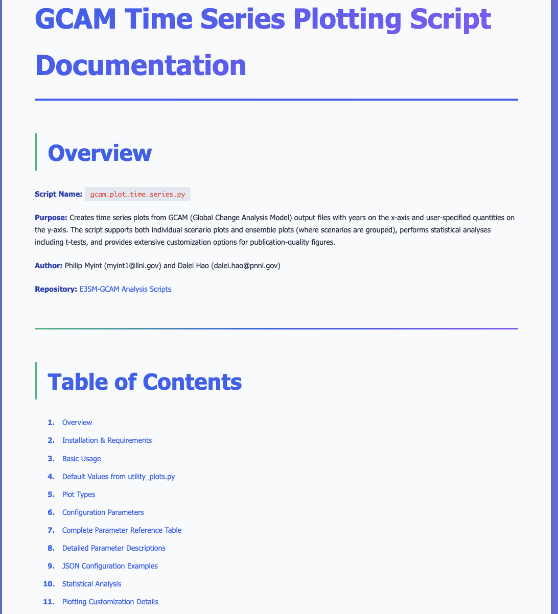
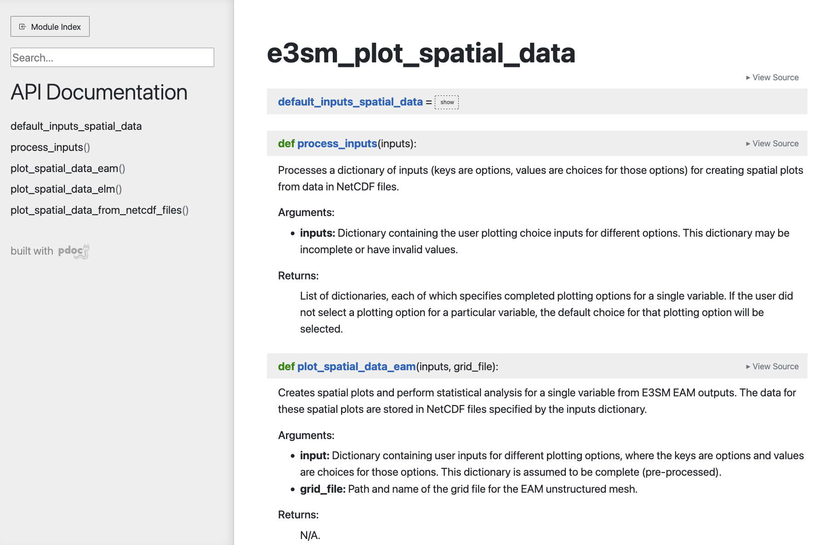

# e3sm--gcam_analysis
Scripts for plotting and analyzing outputs from coupled Energy Exascale Earth System Model ([E3SM](https://github.com/E3SM-Project/E3SM)) and Global Change Analysis Model ([GCAM](https://gcims.pnnl.gov/modeling/gcam-global-change-analysis-model)) simulations. The scripts can be run on a local machine (i.e., a personal laptop) as well as on DOE high-performance computing clusters like Chrysalis. The scripts are motivated by the desire to handle ensembles of E3SM--GCAM simulations generating many terabytes of data, and towards this purpose, they utilize vectorization and multiprocessing to enhance their computational efficiency.

Authors: Philip Myint ([myint1@llnl.gov](mailto:myint1@llnl.gov)) and Dalei Hao ([dalei.hao@pnnl.gov](mailto:dalei.hao@pnnl.gov)), with feedback and guidance from Alan Di Vittorio (LBNL), Sha Feng (PNNL), and Eva Sinha (PNNL).

## Summary of directories
- `scripts`: Contains the scripts, all but one of which is in Python, with the lone exception being in R. Each script can be run by entering `python [script_name].py [json_file].json` or `Rscript [script_name].R [json_file].json` on the command line. Here, the JSON file that is run together with script indicates user options for creating the plots or performing the analysis detailed in the script. The scripts can take in an arbitrary number of JSON files specified through the command line, so the user options can be split up over multiple JSON files if desired. The user does not need to modify any of the scripts to run them; the intent is for them to modify only the corresponding JSON file(s). In addition, the `scripts` directory contains a number of utility files that provide auxiliary functions, default values, constants, and other variables (e.g., dictionaries) used by the main set of scripts. Important utility files that may be worth perusing are `utility_e3sm_netcdf.py`, `utility_gcam.py`, and `utility_plots.py`. The `scripts` directory also contains a `docs` subdirectory with additional documentation described below that may be helpful for users.

- `2025_DiVittorio_et_al_e3sm`: Contains data extracted from E3SM outputs, primarily NetCDF files. When running the scripts with the example JSON files included in this repository (see more details below), the plots and analysis files generated by those examples will appear in this directory as well. This directory already contains some files that have been extracted from E3SM outputs on Chrysalis using the scripts `e3sm_extract_spatial_data_h0.py`, `e3sm_extract_time_series_h0.py`, and `e3sm_extract_time_series_surfdata_iesm_dyn.py` described further below. Specifically, the outputs are taken from earlier runs conducted on Chrysalis that are published in a [2025 paper by Di Vittorio et al](https://agupubs.onlinelibrary.wiley.com/doi/full/10.1029/2024MS004806). The extracted outputs are included for convenience as part of the repo so that the examples are readily runnable on local machines or other DOE clusters, without the hassle of requiring the user to first extract the outputs on Chrysalis.

- `2025_DiVittorio_et_al_gcam`: Contains data extracted from GCAM outputs. Like with E3SM outputs, the GCAM directory already contains pre-extracted data and files from various outputs on Chrysalis, allowing the JSON examples to be runnable on other machines besides Chrysalis. This pre-extracted data include shape files and relevant geographical information on the GCAM regions and basins, a set of files containing soil and vegetation scalars from earlier runs in the [Di Vittorio et al.](https://agupubs.onlinelibrary.wiley.com/doi/full/10.1029/2024MS004806) paper, and a couple of project files extracted from GCAM XML files produced during the earlier runs. 

- `output_headers`: Contains text files for the headers of the different E3SM NetCDF file types used in this repo (for ease of reference).

- `miscellaneous`: Contains two subdirectories:
    - `images`: Contains images used in the README for this repo.
    - `scripts_from_others`: Contains Python and R scripts used in earlier E3SM--GCAM analyses, including some of those used for the [Di Vittorio et al.](https://github.com/aldivi/E3SM-GCAM-JAMES-2024) paper.

## Getting Started
It is recommended for users to first go through this README in the repo. Then try out and experiment with the JSON examples. Further guidance and clarification may be obtained from the following additional documentation.

### Additional documentation
- `scripts/docs`: Within the `scripts` directory, there is a `docs` subdirectory that contains example usage illustrations, explanations of the plots and files being generated by the JSON files, listings of user options with default choices spelled out, etc., in both HTML and markdown formats. This documentation was generated with the assistance of large language modeld, specifically [Anthropic's Claude](https://claude.ai/) Sonnet 4.5 and Opus 4.5 models. For security reasons, Github does not render the HTML files and displays the raw code instead when previewing them. To view the rendered HTML files, which have been stylized with CSS, one can either clone the repo or otherwise download the HTML files, and then open them in a web browser. An example of what these HTML files look like:

- `scripts/docs/docstrings_plus_src_in_html`: Going down one more level in the file structure, there is a `docstrings_plus_src_in_html` subdirectory within `docs` that contains API documentation in the form of HTML files that are generated from docstrings in the Python scripts. These HTML files provide API summaries, including information about the name, a brief description, input parameters, and return values/types of each function in the scripts. The source code itself is also viewable in a color-coded, aesthetically pleasing format in these HTML files. An example of what these HTML files look like:

- [Link to video demo of an earlier version of the scripts (requires E3SM--GCAM Confluence page access)](https://e3sm.atlassian.net/wiki/spaces/HESF/pages/5337678174/Demo+of+Philip+s+E3SM+scripts) 

### Installation
Python 3 is required to run the scripts. The [e3sm_unified Conda environment](https://docs.e3sm.org/e3sm_diags/_build/html/v2.10.1/install.html) that is available on machines like Chrysalis is sufficient. On other machines, the following libraries/modules/packages (plus additional dependencies) may need to be installed to supplement the base Python standard library:
- `geopandas`
- `matplotlib`
- `numpy`
- `pandas`
- `scipy`
- `seaborn`
- `uxarray`
- `xarray`

One of the scripts in the repo, `gcam_extract_csv_from_project_files.R`, is based on R. For this script, the following libraries and packages, plus their dependencies, must be installed:
- `devtools`
- `dplyr`
- `rgcam`
- `rjson`

Finally, one can optionally install [LaTeX](https://www.latex-project.org/). The JSON examples in the repo assume that it has been installed so that LaTeX is used to typeset the axis labels, legends, and titles in the plots. However, the default option in the scripts themselves is actually to not use LaTeX, so one can just delete the `use_latex: true` lines (or set `use_latex: false`) in the JSON files if LaTeX is not installed or not desired. Note that if installing LaTeX on a Linux/Unix machine like Chrysalis, root access is not required; one can follow the instructions [here](https://www.tug.org/texlive/quickinstall.html#running), and specifically follow the steps under `writable destination` to install LaTeX without needing root access.

### Job submissions on high-performance clusters
While the scripts are designed to run efficiently and can be run on personal laptops, some of them might still be very time or memory intensive, depending on the size of the data being processed. When running them on shared clusters like Chrysalis, it may be courteous in such cases to run them on interactive nodes or submit batch jobs. An example for submitting batch jobs on Chrysalis is shown below. The particular scripts that tend to be more resource intensive are the E3SM extraction scripts `e3sm_extract_time_series_h0.py` and `e3sm_extract_spatial_data_h0.py`, and the GCAM script `gcam_add_areas_to_files.py`.
```
# Example script for running the tool in the queue
#!/bin/bash
#SBATCH --job-name=e3sm_analysis
#SBATCH --nodes=4
#SBATCH --time=01:00:00
#SBATCH --partition=debug

source /lcrc/soft/climate/e3sm-unified/load_latest_e3sm_unified_chrysalis.sh

python e3sm_extract_time_series_h0.py e3sm_extract_time_series_h0.json
```

## E3SM scripts
The following is a brief description of the scripts for plotting and analyzing E3SM output. To test out these scripts, run them on the command line with the JSON file(s). The JSON examples provided in the repo share the same name with their corresponding scripts. The scripts are listed below in roughly the order in which they should be run: 1) first extract the relevant quantities (e.g., temperature, precipitation, CO<sub>2</sub> concentrations, landunit areas) from E3SM-generated NetCDF files into output files containing time series, land use/land cover, and spatial data using `e3sm_extract_time_series_h0.py`, `e3sm_extract_time_series_surfdata_iesm_dyn.py`, or `e3sm_extract_spatial_data_h0.py`, respectively; 2) if necessary (such as for testing purposes), produce synthetic ensembles of data with `e3sm_produce_synthetic_spatial_data.py` and `e3sm_produce_synthetic_time_series.py`; 3) create either time series plots or spatial plots with `e3sm_plot_time_series.py` or `e3sm_plot_spatial_data.py`, respectively. 

### `e3sm_extract_time_series_h0.py`
Extracts time series data from E3SM-generated .h0 NetCDF files and puts the results into a .csv or fixed-width format tabular .dat file. Each of the NetCDF files contains E3SM output for a particular month and year of a simulation. Each block in a JSON file corresponds to a single .csv or .dat file, and one can specify in that block the start and end years for collecting the time series, the specific variables to extract from the NetCDF files, and whether additional processing is to be done on the time series. E3SM by default produces outputs in SI units, so that, for example, fluxes are in units of kg/m<sup>2</sup>/s, but the additional processing changes the units to Pg/year, which is more amenable to interpreting fluxes on a global scale. The processing also adds new variables to the .csv or .dat files, such as the total precipitation rate and the near-ground mole fraction of CO<sub>2</sub> in dry air (i.e., with humidity subtracted out). By default, the script extracts data over the entire globe (over all latitude/longitudes), but the extraction can be limited to specific regions (e.g., North America, the Amazon, Southeast Asia) if desired by entering a line with the `regions` keyword, as demonstrated in a few of the JSON example blocks; see `utility_e3sm_netcdf.py` for a list of the available regions and the bounds on their latitude/longitude coordinates. The user may refer to the HTML documentation in `scripts/docs` or `scripts/docs/docstrings_plus_src_in_html` for more details.

### `e3sm_extract_time_series_surfdata_iesm_dyn.py`
Works similarly to `e3sm_extract_time_series_h0.py`, but instead of extracting time series from the NetCDF h0 files, it extracts time series from NetCDF files generated dynamically during run time by the E3SM human component (EHC), where these files contain land surface data like areas for different landtype covers (e.g., forest, grass, crop, shrub) and land use (e.g., harvest, grazing).

### `e3sm_extract_spatial_data_h0.py`
Extracts data needed to make spatial plots from the NetCDF h0 files. Unlike the two other E3SM extraction scripts described above, this script produces a NetCDF file as its output for each block in a JSON file. This NetCDF file contains data between only the start and end years for the specific variables listed in the JSON block. Thus, the resulting file is typically much smaller and more manageable than the raw NetCDF files produced directly by E3SM. Additional processing to add variables like the total precipitation rate and the near-ground mole fraction of CO<sub>2</sub> in dry air are automatically performed, although unlike for the time series data, conversions to larger global-scale units (e.g., from kg to Pg) are not performed since the spatial data will be visualized/analyzed on a per-gridcell basis instead of taken as an aggregate over the entire globe.

### `e3sm_produce_synthetic_spatial_data.py` and `e3sm_produce_synthetic_time_series.py`
Produces synthetic spatial data and time series sets by applying random numbers to existing NetCDF (for spatial data) or .csv/.dat (for time series) files. The intent is to create synthetic ensembles of simulations, so that one can then test out the plotting and analysis capabilities of the scripts on ensembles. Unlike the other E3SM scripts, example JSON files are not provided for `e3sm_produce_synthetic_spatial_data.py` and `e3sm_produce_synthetic_time_series.py` because they are for testing purposes only and not intended to be used when actual ensembles of simulation data are available. As a result, any desired changes will have to be made to these Python scripts themselves.

### `e3sm_plot_time_series.py`
Reads in the .csv or .dat files generated by the time series extraction scripts to produce a plot for each variable in the .csv/.dat files. The user can list the specific variables that they want to plot in the JSON files, but if no variables are specified, a time series plot will be generated for every variable in the .csv/.dat file. Plotting options can be customized for each variable so that, for example, if a line in the JSON file reads `"y_label": {"ZCO2": "CO$_2$ concentration (ppm)", "SFCO2": "CO$_2$ surface flux (Pg C/month)"}`, the indicated y-axis labels will be used for the ZCO2 and SFCO2 plots, but a default y-axis label will be used for the plots of all other variables. A single keyword option with no variable name attached to it means that the default will be overriden for all variables. For example, the line `"use_latex": true` that is present in the example JSON files means that LaTeX will be used to generate the text in the plots of all the variables, overriding the default to not use LaTeX. In `e3sm_plot_time_series.py`, and in all of the other plotting scripts described below, there is a dictionary defined near the top of the script that displays the different possible keyword options and the default values for these options. Plotted quantities are averages or sums over each year, but there are options to include seasonal averages in the plots, to put these seasonal averages in their own separate plots, as well as to create monthly time series plots (where the x-axis labels are "January, February, etc.") to analyze monthly variations in the variables.

Simulations can be further subdivided into ensembles (groups) by listing them in a list of lists (i.e., a 2D list or nested list), as shown in the example JSON below. This example involves a total of 20 simulations, which are divided into 4 groups/ensembles, each representing a different scenario, where each group has 5 members. In this example, 4 curves would appear on the plots, where each curve represents the mean of the 5 members in each group. The error bars around each curve represent +/-X standard deviations from the mean for that group, where X = 1 by default. A t-test is conducted at each time period (year or month, depending on if we are plotting annual or monthly time series) to compare the first group (labeled as `control` in the example below) to each of the other 3 groups. If the p-value from the t-test for a group falls below the user-specified threshold (default is 0.05) in a particular time period, this will be indicated by a symbol added at that year or month on the curve for that group. In addition, t-tests are performed for the time series taken as a whole over all years or all months.
```
"output_files": [
    ["./../2025_DiVittorio_et_al_e3sm/control_time_series.dat", "./../2025_DiVittorio_et_al_e3sm/control_time_series_2.dat",
    "./../2025_DiVittorio_et_al_e3sm/control_time_series_3.dat", "./../2025_DiVittorio_et_al_e3sm/control_time_series_4.dat",
    "./../2025_DiVittorio_et_al_e3sm/control_time_series_5.dat"],
    ["./../2025_DiVittorio_et_al_e3sm/full_feedback_time_series.dat", "./../2025_DiVittorio_et_al_e3sm/full_feedback_time_series_2.dat",
    "./../2025_DiVittorio_et_al_e3sm/full_feedback_time_series_3.dat", "./../2025_DiVittorio_et_al_e3sm/full_feedback_time_series_4.dat",
    "./../2025_DiVittorio_et_al_e3sm/full_feedback_time_series_5.dat"],
    ["./../2025_DiVittorio_et_al_e3sm/ag_scaling_time_series.dat", "./../2025_DiVittorio_et_al_e3sm/ag_scaling_time_series_2.dat",
    "./../2025_DiVittorio_et_al_e3sm/ag_scaling_time_series_3.dat", "./../2025_DiVittorio_et_al_e3sm/ag_scaling_time_series_4.dat",
    "./../2025_DiVittorio_et_al_e3sm/ag_scaling_time_series_5.dat"],
    ["./../2025_DiVittorio_et_al_e3sm/carbon_scaling_time_series.dat", "./../2025_DiVittorio_et_al_e3sm/carbon_scaling_time_series_2.dat",
    "./../2025_DiVittorio_et_al_e3sm/carbon_scaling_time_series_3.dat", "./../2025_DiVittorio_et_al_e3sm/carbon_scaling_time_series_4.dat",
    "./../2025_DiVittorio_et_al_e3sm/carbon_scaling_time_series_5.dat"]
],
```
Alternatively, there is an option in the JSON files to treat each simulation individually, rather than grouping them together into ensembles. To specify that one wants to create these "individual" plots, the user can list the output files in a 1D list, rather than a list of lists, and/or they can set the option `"plot_type": individual` in the JSON files. In the example below, each of the 20 simulations would be treated as individual, independent data sets so that 20 different curves would appear on the plots. In these individual plots, a year-by-year or month-by-month series of t-tests is not performed (such tests would not be meaningful since the time series are not grouped into ensembles so that each "group" has only one member), but a t-test is performed to compare the entirety (taken as a whole over all time periods) of the first simulation listed in the JSON file against each of the subsequently listed simulations.
```
"output_files": ["./../2025_DiVittorio_et_al_e3sm/control_time_series.dat", "./../2025_DiVittorio_et_al_e3sm/control_time_series_2.dat",
    "./../2025_DiVittorio_et_al_e3sm/control_time_series_3.dat", "./../2025_DiVittorio_et_al_e3sm/control_time_series_4.dat",
    "./../2025_DiVittorio_et_al_e3sm/control_time_series_5.dat", "./../2025_DiVittorio_et_al_e3sm/full_feedback_time_series.dat", 
    "./../2025_DiVittorio_et_al_e3sm/full_feedback_time_series_2.dat", "./../2025_DiVittorio_et_al_e3sm/full_feedback_time_series_3.dat", 
    "./../2025_DiVittorio_et_al_e3sm/full_feedback_time_series_4.dat", "./../2025_DiVittorio_et_al_e3sm/full_feedback_time_series_5.dat",
    "./../2025_DiVittorio_et_al_e3sm/ag_scaling_time_series.dat", "./../2025_DiVittorio_et_al_e3sm/ag_scaling_time_series_2.dat",
    "./../2025_DiVittorio_et_al_e3sm/ag_scaling_time_series_3.dat", "./../2025_DiVittorio_et_al_e3sm/ag_scaling_time_series_4.dat",
    "./../2025_DiVittorio_et_al_e3sm/ag_scaling_time_series_5.dat", "./../2025_DiVittorio_et_al_e3sm/carbon_scaling_time_series.dat", 
    "./../2025_DiVittorio_et_al_e3sm/carbon_scaling_time_series_2.dat", "./../2025_DiVittorio_et_al_e3sm/carbon_scaling_time_series_3.dat", 
    "./../2025_DiVittorio_et_al_e3sm/carbon_scaling_time_series_4.dat", "./../2025_DiVittorio_et_al_e3sm/carbon_scaling_time_series_5.dat"],
```

### `e3sm_plot_spatial_data.py`
Reads in the NetCDF files generated by `e3sm_extract_spatial_data_h0.py` to produce a spatial plot (a global map) for each variable that is present in the NetCDF files. The spatial data represent either means or sums computed at each gridcell on the global map over user-specified start and end years. Like with `e3sm_plot_time_series.py`, the user can list the specific variables that they want to plot in the JSON files, but if no variables are specified, a spatial plot will be generated for every variable in the NetCDF file. Plotting options can be customized for each variable in a similar way as well. The script can currently create plots for outputs from the E3SM atmosphere model (EAM) and the E3SM land model (ELM). Because EAM operates on an unstructured mesh, in each JSON block that makes EAM spatial plots, the user must specify the full path (location and name) of the grid file that describes the connectivity of the grid points. 

Similar to `e3sm_plot_time_series.py`, the user can divide the simulations into ensembles/groups (in which case ensemble means will be examined and plotted) by arranging them in a list of lists in the JSON file, or alternatively they can treat them as individual (ungrouped) data sets and plot the mean or sum of the data sets on the spatial plot. In both cases, t-tests are performed to compare the first data set (which could be a group of simulations) against all other data sets over the entirety of those data sets, meaning over all latitude/longitude coordinates. In addition, if making an ensemble plot so that the scenarios are arranged as a list of lists, a t-test is conducted at each gridcell (each latitude/longitude coordinate) to compare two different groups of simulations. If the p-value from the t-test falls below the user-specified threshold (default is 0.05) at a particular gridcell, this will be indicated by stippling (hash marks) added to that gridcell on the spatial map. Currently, this per-gridcell t-test and stippling is available only for ELM outputs; the unstructured nature of the EAM outputs requires some additional processing that makes the t-tests too slow to be completed in a reasonable amount of time. Ensemble plots are restricted to two groups, since unlike time series, it is not meaningful to produce a spatial plot if there are more than two groups. If there are two groups or two data sets, users have additional options to plot either absolute differences, percent differences, or the two data sets separately.

### Future work:
- Extraction of time series and spatial data from h0 files if the h0 files are printed out at arbitrary time intervals and not just monthly intervals like in the currently available set of outputs on Chrysalis. 
- Add ability to plot the spatial distribution of plant functional type (PFT) categories---including both individual types and aggregated subgroups like forest, shrub, grass---and land unit types (e.g., vegetation fraction). Right now, the scripts can only make time series plots of PFT categories and land unit types.
- Stippling is currently restricted to ELM spatial plots; add capability to add stippling for EAM spatial plots.

## GCAM scripts
The following is a brief description of the scripts for plotting and analyzing GCAM output. Just like with the E3SM output, run them on the command line with the appropriate JSON file(s). The JSON examples provided in the repo share the same name with their corresponding scripts. The scripts are listed below in roughly the order in which they should be run: 1) first extract the relevant quantities into individual .csv output files using `gcam_extract_csv_from_project_files.R`; 2) process these files using `gcam_process_extracted_data.py`; 3) if soil and vegetation scalars are desired, compile and process them with `gcam_compile_ehc_scalars.py`; 4) add land allocation area information to the files with `gcam_add_areas_to_files.py`; 5) create either time series plots, box plots, or spatial plots with `gcam_plot_time_series.py`, `gcam_plot_box_and_whiskers.py`, or `gcam_plot_spatial_data.py`, respectively. 

In the plots described below, the user can choose to plot quantities based on the scenario, region, and/or category, where category could refer to sectors like in the case of agricultural commodity prices or landtypes (e.g., forest, crop, pasture, grass, shrub) like in the case of land allocations. The default labels for scenario, region, and category in these plotting scripts are listed in their corresponding HTML documentation (or can be viewed in the source code directly), but one can override these defaults to match the column labels in the .csv files by appropriately setting `scenario_label`, `region_label`, etc. in the JSON files.

### `gcam_extract_csv_from_project_files.R`
Extracts data from project files and writes the extracted data to .csv files. The project files are obtained by applying the query tools in the `rgcam` R package to large XML files that are produced by GCAM during a simulation. This script assumes that this earlier step of obtaining the project files from the XML files has already been performed. Unlike the E3SM outputs, where a single .csv file contains multiple different output quantities that can be plotted, each .csv file generated here contains data for only a single quantity. 

### `gcam_process_extracted_data.py`
Performs additional processing on the .csv files extracted by `gcam_extract_csv_from_project_files.R`. This script can be used to drop unnecessary columns and sort by a set of columns by adding a `keys` input line in the JSON file to create a multi-index object. Optionally, one can perform a crop name standardization by setting `call_modify_crop_names: true` in the corresponding JSON file. If this is set to true, crop names under the landtype column will be modified to a set of names defined in the `gcam_crop_mappings` dictionary located in `utility_gcam.py`. For example, by applying this standardization, all `biomass`, `biomassGrass`, and `biomassTree` entries in the landtype column of the .csv file will be converted to `BioenergyCrop`. This is necessary for certain files because crop names are not consistent across all simulation output files. For example, the land allocations and the vegetation and soil scalars (see below) have `biomass`, `biomassGrass`, and `biomassTree` entries, while agricultural commodity prices contain only `biomass` entries. The standardization addresses this inconsistency by producing a common set of crop names. Besides viewing `utility_gcam.py` directly, one can view the `gcam_process_extracted_data.html` file under `scripts/docs` (see the Additional Documentation subsection above) to see the full mapping of all the crop names. This HTML file also lists which specific GCAM landtypes are associated together into landtype groups like forests, pasture, shrub, grass, etc.; these landtype groups are defined in `utility_gcam.py`.

### `gcam_compile_ehc_scalars.py`
During the course of a coupled E3SM--GCAM simulation, the E3SM human component (EHC) dynamically generates .csv files on soil and vegetation multipliers, referred to as scalars in the [Di Vittorio et al. paper](https://agupubs.onlinelibrary.wiley.com/doi/full/10.1029/2024MS004806), and it then passes these scalars to GCAM. This script compiles all those .csv files into a single .csv file. It does some additional processing to split the 'landtype_basin' column into separate landtype and basin (i.e., watershed or catchment) columns. One can also optionally perform the crop name modification described above.

### `gcam_produce_synthetic_data.py`
Generates synthetic data using random numbers to mimic an ensemble of simulations. Like the case with its E3SM analogues (`e3sm_produce_synthetic_spatial_data.py` and `e3sm_produce_synthetic_time_series.py`), this script is for testing purposes only and is not intended to be run when actual ensembles of simulations are available. As a result, there is no JSON file provided for this script.

### `gcam_add_areas_to_files.py`
Adds an extra column indicating the area to the .csv files specified in the accompanying JSON file. This script assumes that detailed land allocations (which contains areas for each region, basin, year, and landtype combination) have been extracted using `gcam_extract_csv_from_project_files.R`, and each JSON block must specify the location and name of the land allocation file. The area entries in the land allocation file are matched up with and added to the corresponding entries in the .csv files. If a .csv file contains regions and is not further broken down into basins, the area that is added for that region is the sum of the areas over all basins that make up that region. If there is no match between the .csv file and the land allocation file for a particular region, basin, year, and landtype combination, the area for that combination is set to 0. These land areas can then later be used to compute and plot area-weighted means and sums. Here, once again, the user can choose to use either the original or modified/standardized set of crop names. Even if original names were used earlier in `gcam_process_extracted_data.py` or `gcam_compile_ehc_scalars.py`, the user can choose to convert them to the modified set of names at this stage of the processing.

### `gcam_plot_time_series.py`
Produces time series plots from the .csv files generated by the GCAM extraction and processing scripts listed above. Each block in the JSON file corresponds to one plot, and it specifies the name of the .csv file, the scenario or scenarios (i.e., simulations) of interest from that file, and the particular quantity or quantities that the user wants to plot, which is specified through a list labeled as `categories` in the JSON file. The data can be further broken down into region-specific time series. In the example JSON file provided in the repo, `categories` refer to either sectors or landtypes, but any column from the .csv file could be chosen by appropriately setting the `category_label`. If `categories` refer to landtypes, some of the landtypes can be grouped together into aggregated landtypes; for example, the landtype `forest` is a grouping of three individual landtypes: `Forest`, `ProtectedUnmanagedForest`, `UnmanagedForest`. Lists defining these landtype groups are defined in `utility_gcam.py` and follow the convention described in [Di Vittorio et al.](https://agupubs.onlinelibrary.wiley.com/doi/full/10.1029/2024MS004806) Again, one can also refer to the HTML documentation (e.g., `gcam_plot_time_series.html` or `gcam_add_areas_to_files.html` or `gcam_process_extracted_data.html` in `scripts/docs/`) for more details on the landtype groups. As explained above, the scripts define two different `crop` landtype groups, with either the original or modified/standardized crop names. The default in `gcam_plot_time_series.py` is to use the modified set of names, but this can be changed by setting `landtype_groups: original` in the JSON file; regardless, the choice should match what was chosen in earlier in `gcam_add_areas_to_files.py`. The JSON example produces plots for total crop area land allocations in both the original and modified set of names, from which one can verify that both choices result in the same total crop areas (as they should). 

Like with `e3sm_plot_time_series.py` and `e3sm_plot_spatial_data.py`, one can make either ensemble plots or individual plots. In the former, the scenarios must grouped together into a list of lists in the JSON file, where each group represents an ensemble of simulations (e.g., the same scenario started with different initial conditions) and the means of each of the ensembles are compared against each other. If not grouped into ensembles (i.e., the scenarios are arranged in a 1D list in the JSON file), the time series are treated as individual, independent data sets. Various statistical tests are performed to compare the different data sets, including per-year t-tests between different groups/ensembles of scenarios. 

### `gcam_plot_box_and_whiskers.py`
Produces box (or box-and-whisker) plots from the .csv files generated by the GCAM extraction and processing scripts, where each block in the JSON file corresponds to one plot. By default, each box corresponds to the different specified `categories`, but the user can override this default by setting the `x_variable` option to display some other quantity on the x-axis. Moreover, separate subgroups within the same `x_variable` or category can be set with the `hue` (color) option. Specific regions or basins may be selected to be either the `x_variable` or the `hue` category, or if they are neither an `x_variable` or `hue`, they can be specified to restrict the data displayed on the plot to the listed regions and/or basins. Like with time series plots, the user can choose to make individual plots or ensemble plots, where in the latter, the scenarios are grouped together into a list of lists, so that a box-and-whisker set on the plot corresponds to one ensemble/group of scenarios.

### `gcam_plot_spatial_data.py`
Produces spatial plots from the .csv files generated by the GCAM extraction and processing scripts, where each block in the JSON file corresponds to one plot. In the JSON file, the user must specify a shape file, which lists the latitude/longitude coordinates of the polygons that make up the regions and basins on the map. Like with all the other plots for both GCAM and E3SM outputs, one can group together different scenarios into a list of lists (ensembles) or have the scenarios be treated as independent, individual data sets. Statistical tests are performed to compare the different data sets, which includes t-tests performed globally and per-region or per-basin t-tests between different groups of scenarios. Like in the case of ELM spatial plots generated by `e3sm_plot_spatial_data.py`, stippling can be added to indicate the regions and/or basins where the p-value from the t-tests falls below some user-defined threshold.